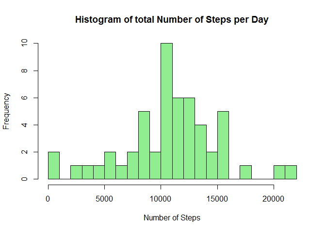
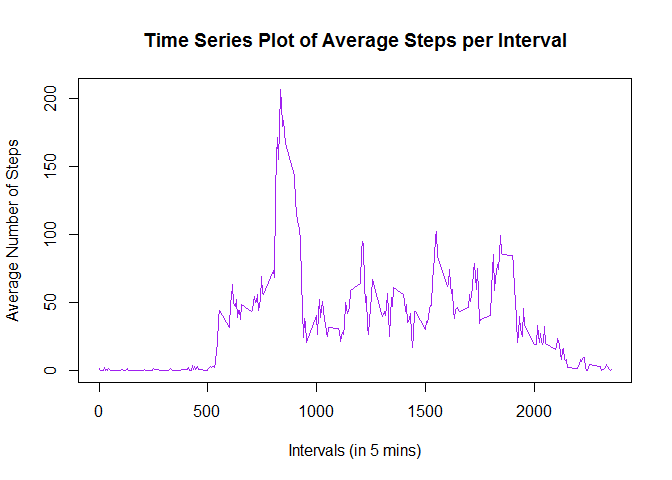
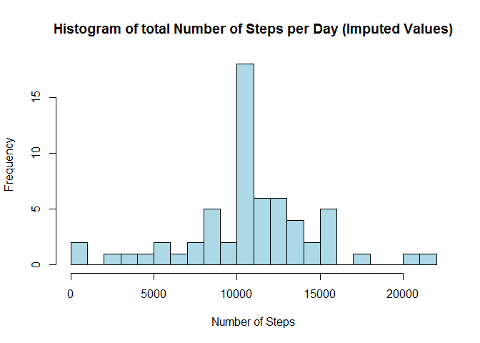
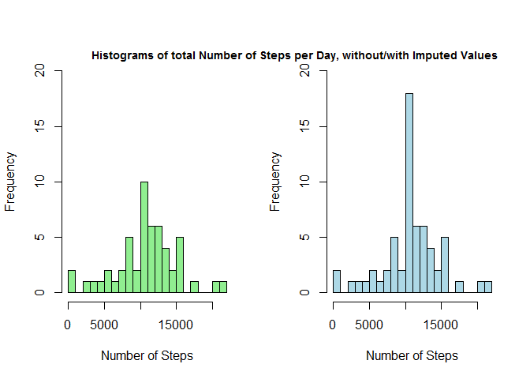
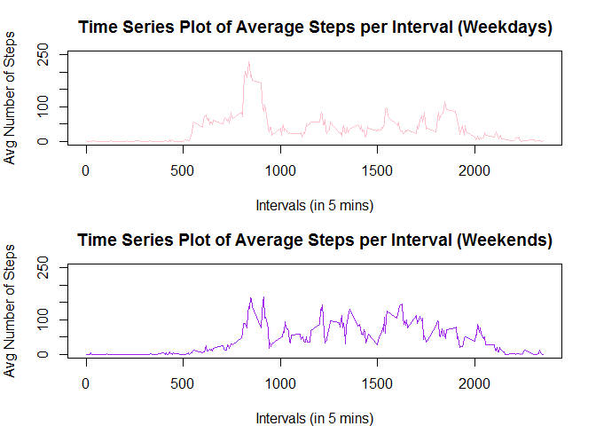

## Loading and preprocessing the data

**1. Write the code for reading in the data set and processing the data.**


With *read.csv()* the data is read into the global environment.

```r
setwd("C:/Users/hedy med/Desktop/Coursera/R/JHU Data Science/5. Reproducible Research/Week 2")
activity <- read.csv("./activity.csv", header = TRUE, sep = ",", colClasses = c("numeric", "Date", "numeric"))
```

The commands *head()* and *str()* will give a quick overview over the data set.

```r
head(activity)
```

```
##   steps       date interval
## 1    NA 2012-10-01        0
## 2    NA 2012-10-01        5
## 3    NA 2012-10-01       10
## 4    NA 2012-10-01       15
## 5    NA 2012-10-01       20
## 6    NA 2012-10-01       25
```

```r
str(activity)
```

```
## 'data.frame':	17568 obs. of  3 variables:
##  $ steps   : num  NA NA NA NA NA NA NA NA NA NA ...
##  $ date    : Date, format: "2012-10-01" "2012-10-01" ...
##  $ interval: num  0 5 10 15 20 25 30 35 40 45 ...
```


## What is mean total number of steps taken per day?


**2. Create a histogram of the total number of steps taken each day.**


For the first part of the assignment missing values in the data set can be ignored.

```r
activityNArem <- activity[!(is.na(activity$steps)), ]
```

To calculate the total steps per day, the data needs to be grouped for each day, and then the sum has to be calculated.

```r
dailyTotalSteps <- aggregate(steps ~ date, activityNArem, sum)
head(dailyTotalSteps)
```

```
##         date steps
## 1 2012-10-02   126
## 2 2012-10-03 11352
## 3 2012-10-04 12116
## 4 2012-10-05 13294
## 5 2012-10-06 15420
## 6 2012-10-07 11015
```


The following histogram depicts the frequency of total steps taken each day.

```r
with(dailyTotalSteps, hist(steps, breaks = 25, xlab = "Number of Steps", 
                           main = "Histogram of total Number of Steps per Day",
                           col = "light green"))
```

<!-- -->


**3. What is the mean and median number of steps taken each day?**


With the *dplyr* package the mean and median of the daily steps can be summarized. Message is set to false to avoid the messages when loading *dplyr* from the library. 

```r
library(dplyr)
totalStepsSummary <- summarise(dailyTotalSteps, meanOfTotalSteps = mean(dailyTotalSteps$steps),medianOfTotalSteps = median(dailyTotalSteps$steps))
print(totalStepsSummary)
```

```
##   meanOfTotalSteps medianOfTotalSteps
## 1         10766.19              10765
```
As seen in the result chunk, the mean of total steps per day is **10766.19** and the median is **10765**. 


## What is the average daily activity pattern?

**4. Create a time series plot of the average number of steps taken.**


For this we aggregate the data set for each interval.

```r
meanStepsInterval <- aggregate(steps ~ interval, activityNArem, mean)
```

The base plot system is used to depict a time series plot for the average steps taken per 5-minute interval. Interval 0-5 represents the time from 0:00 - 0:05, Interval 5-10 represents the time from 0:05 - 0:10 and so on. 

```r
with(meanStepsInterval, plot(x = interval, y = steps, type = "l", 
                             col = "purple", lwd = 1.5,
                             xlab = "Intervals (in 5 mins)", 
                             ylab = "Average Number of Steps", 
                             main = "Time Series Plot of Average Steps per Interval"))
```

<!-- -->


**5. Which 5-minute interval contains on average the maximum number of steps?**


To calculate this, the function *which.max()* can be used. It prints the numeric vector of the location with maximum value. In order to get the correct interval, the result has to be embedded in the print function for the interval.

```r
with(meanStepsInterval, print(interval[which.max(steps)]))
```

```
## [1] 835
```
The interval with the maximum number of steps is interval **835**, or **08:35**.


## Imputing missing values

**6. Construct a code that deals with multiple value imputations.**

It is necessary to find out which data is missing in the data set. To see that the number of missing values for each column has to be calculated. 


```r
data.frame(steps=sum(is.na(activity$steps)),
           interval=sum(is.na(activity$interval)),
           date=sum(is.na(activity$date)))
```

```
##   steps interval date
## 1  2304        0    0
```

It can be seen that all 2304 NA values are contained within the steps variable.

An imputing strategy must be devised to replace all of the missing values with usable numeric measurements.There are multiple strategies to deal with multiple value imputations.

The common strategies include:

1. Constant value imputations
2. Regression model value imputations
3. Mean/mode value substitutions

I decided to replace each missing value with the mean value for the same interval, averaged across all days.

A loop function is created to, first, test if each observation is an NA value, and if so, the NA value will be replaced by the mean average for that interval.


```r
imputedActivity <- activity
for (i in 1:nrow(activity)) {
     if (is.na(imputedActivity[i, 1]) == TRUE) {
          imputedActivity[i, 1] <- meanStepsInterval[meanStepsInterval$interval
                                                     %in% imputedActivity[i, 3],
                                                     2]
     }   
}

head(imputedActivity)
```

```
##       steps       date interval
## 1 1.7169811 2012-10-01        0
## 2 0.3396226 2012-10-01        5
## 3 0.1320755 2012-10-01       10
## 4 0.1509434 2012-10-01       15
## 5 0.0754717 2012-10-01       20
## 6 2.0943396 2012-10-01       25
```


**7. Create a histogram that depicts the total number of steps taken each day after missing values are imputed.**


Now that the NA values have been replaced, a histogram from the imputed data can be created. This histogram should indicate the frequency of the total number of steps taken per day.

In a first step the imputed data has to be aggregated and summed by day.


```r
dailyImputedSteps <- aggregate(steps ~ date, imputedActivity, sum)
```

The following code creates a histogram for the imputed data set.


```r
with(dailyImputedSteps, hist(steps, breaks = 25, xlab = "Number of Steps", 
                           main = "Histogram of total Number of Steps per Day (Imputed Values)", col = "light blue"))
```

<!-- -->


The mean and median of the imputed data set will be calculated in the following.


```r
library(dplyr)
imputedStepsSummary <- summarise(dailyImputedSteps, meanOfTotalSteps =
                                 mean(dailyImputedSteps$steps),
                                 medianOfTotalSteps =
                                 median(dailyImputedSteps$steps))
print(imputedStepsSummary)
```

```
##   meanOfTotalSteps medianOfTotalSteps
## 1         10766.19           10766.19
```


These results can be compared to the mean and median of the data set where missing values were removed.


```r
rbind(totalStepsSummary, imputedStepsSummary)
```

```
##   meanOfTotalSteps medianOfTotalSteps
## 1         10766.19           10765.00
## 2         10766.19           10766.19
```

The values of the two data sets are very similar, if not exactly the same, due to the use of averaging functions when imputing the NA measurements. The mean values are the same, at **10766.19** steps, while the median value is slightly larger for the imputed data set, at **10766.19** steps, rather than **10765** steps.

To compare the total number of steps in the imputed and not-imputed data set, the two histograms of the data will be depicted in the same plot.


```r
par(mfrow = c(1,2))
with(dailyTotalSteps, hist(steps, breaks = 25, xlab = "Number of Steps", 
                           col = "light green", ylim = c(0,20), main = NULL))
with(dailyImputedSteps, hist(steps, breaks = 25, xlab = "Number of Steps", 
                           col = "light blue", ylim = c(0,20), main = NULL))
mtext("Histograms of total Number of Steps per Day, without/with Imputed Values", adj = 1, font = 2, cex = 0.9)
```

<!-- -->


Since the mean values have been used to replace missing values, the frequency for steps at mean value has been increased drastically. This can be seen in the histogram comparison. The bar in the center of the histogram is much higher than before, whereas the bars at the side remained the same.


## Are there differences in activity patterns between weekdays and weekends?

**8. Create a panel plot comparing the average number of steps taken per 5-minute interval across weekdays and weekends.**

To create the plot, the imputed data set will be used. 
In a first step, a new factor variable will be created within the data frame. The variable will indicate whether each day is a "weekday" or a "weekend".


```r
weekData <- imputedActivity
weekData$days <- weekdays(weekData$date)
weekData$weekday <- as.character(rep(0, times=nrow(imputedActivity)))
for(i in 1:nrow(imputedActivity)) {
    if(weekData[i, 4] %in% c("Saturday", "Sunday")) {
        weekData[i, 5] <- "weekend"
    } else {
        weekData[i, 5] <- "weekday"
    }
}
weekData$weekday <- factor(weekData$weekday)
head(weekData)
```

```
##       steps       date interval   days weekday
## 1 1.7169811 2012-10-01        0 Monday weekday
## 2 0.3396226 2012-10-01        5 Monday weekday
## 3 0.1320755 2012-10-01       10 Monday weekday
## 4 0.1509434 2012-10-01       15 Monday weekday
## 5 0.0754717 2012-10-01       20 Monday weekday
## 6 2.0943396 2012-10-01       25 Monday weekday
```

To compare the weekday and weekend data, and create two plots of the average number of steps taken per interval, the data has to be split into weekday/weekend data.


```r
weekdayData <- weekData[weekData$weekday=="weekday", ]
weekendData <- weekData[weekData$weekday=="weekend", ]
```

Now the average number of steps per interval can be calculated.


```r
weekdayMean <- aggregate(steps ~ interval, weekdayData, mean)
weekendMean <- aggregate(steps ~ interval, weekendData, mean)
```

In the final step, the panel plot is created. 


```r
par(mfrow = c(2, 1), mar=c(4, 4, 3, 2))
plot(weekdayMean$interval, weekdayMean$steps, type="l",
     main = "Time Series Plot of Average Steps per Interval (Weekdays)",
     xlab = "Intervals (in 5 mins)", ylab = "Avg Number of Steps", 
     lwd = 1.5, col = "pink", ylim =c (0, 250))
plot(weekendMean$interval, weekendMean$steps, type="l",
     main = "Time Series Plot of Average Steps per Interval (Weekends)",
     xlab = "Intervals (in 5 mins)", ylab = "Avg Number of Steps", 
     lwd = 1.5, col = "purple", ylim = c(0, 250))
```

<!-- -->


